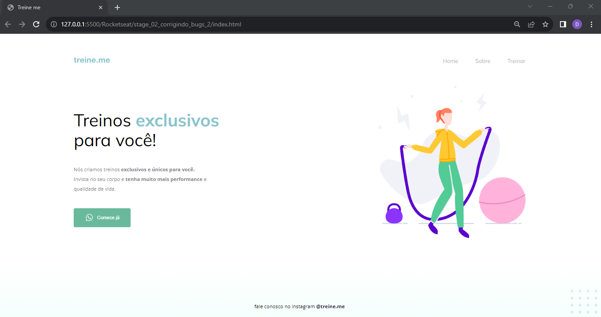

# Semântica e acessibilidade | Explorer Stage 2

### Essa tarefa faz parte do curso Explorer da [Rocketseat](https://www.rocketseat.com.br).

Nessa atividade foi corrigido alguns bugs do projeto na parte do HTML, com foco em: 

- Correção de algumas tags do HTML;
- Posicionamento e alinhamento de elementos na tela;
- Aplicando fontes customizadas;
- Espaçamentos;

## 🔖 Layout 

Figma do projeto disponível nesse [Link](<https://www.figma.com/file/rkDOHGPwwFtBNqEdHSuQPd/Projeto-02---Explorer?node-id=0%3A1&mode=dev>).